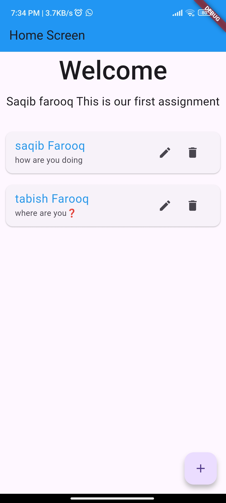
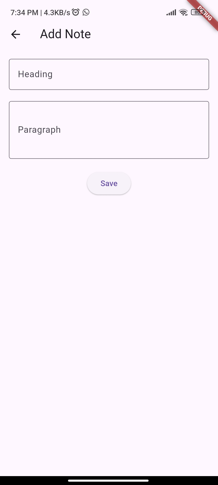

# 📝 Notes Management App (Flutter)

A simple and clean Notes Management App built using Flutter.  
This app allows users to create, edit, and manage notes easily.

---

## 📱 Screenshots

<p align="center">
  
  
  
</p>

<p align="center">
  <b>Home Screen</b> &nbsp;&nbsp;&nbsp;&nbsp;
  <b>Notes Screen</b> &nbsp;&nbsp;&nbsp;&nbsp;
  <b>Details Screen</b>
</p>

---

## ✨ Features

- ➕ Add new notes  
- 📋 View notes in a list  
- ✏️ Edit existing notes  
- 🗑️ Delete notes  

---

## 🛠 Tech Stack

- Flutter  
- Dart  

---

## 📖 Description

This project is a beginner-friendly Notes Management App built using Flutter.  
It demonstrates core concepts like:

- CRUD operations (Create, Read, Update, Delete)  
- Navigation between screens  
- State management using `setState`  
- Dynamic UI updates  
- ListView implementation  

---

## 🚀 Getting Started

1. Clone the repository  
   ```bash
   git clone https://github.com/your-username/your-repo-name.git
